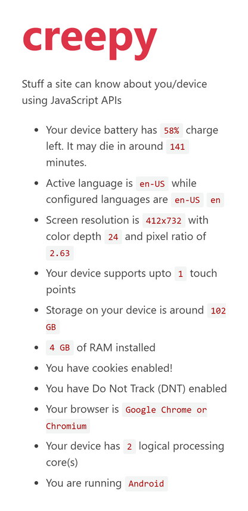

# [creepy](https://creepy.now.sh)

> A demo to illustrate what a site can know about it's visitors using JavaScripts APIs.

By visiting any website various amounts of data can be obtained by a site without any
user concent. This data can then be used for targetting ads or tracking. Advanced
techniques, like ones used in [panopticlick](https://panopticlick.eff.org) can
effeciently track users by using various standard and non standard APIs.

## Tested APIs

> From [MDN Navigator API](https://developer.mozilla.org/en-US/docs/Web/API/Navigator) docs

1. Battery status
2. System languages
3. Screen size and specifications
4. Touch capabilities
5. Storage Quota
6. Webdriver used?
7. Installed system memory
8. Cookies enabled?
9. DNT enabled?
10. User Agent string testing
11. System processing cores
12. Operating System info
13. System architechture
14. (TODO) Geolocation

All the above listed APIs can be accessed **without any** user concent.

## Screenshot

## Related

* https://github.com/wybiral/wtf
* https://panopticlick.eff.org

## License

[MIT](LICENSE)
